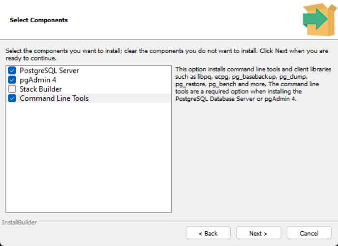
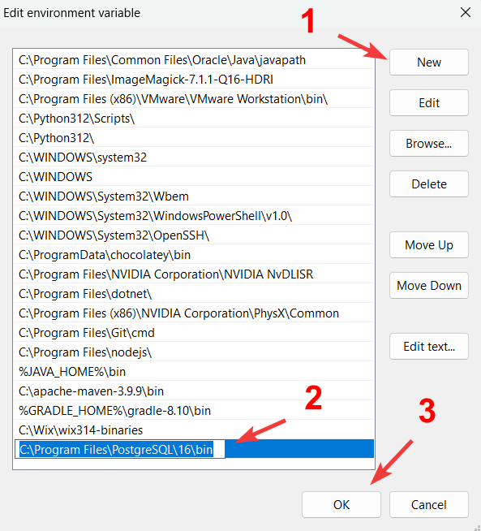
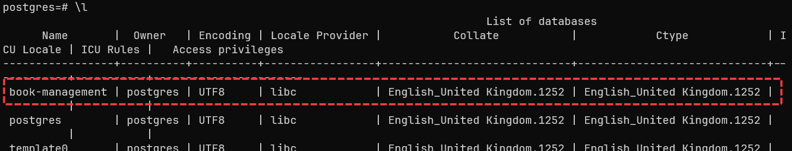

# big-project-group-6

Big Project about Book Management with Java OOP

- bgsix: Is the team name: Big Group Six (nhom 6)

## Table of Contents

1. [Setup Postgresql](#postgresql-installation-for-windows) for Windows
2. [Setup Project](#setup-project)

## Postgresql installation for Windows

### 1. Install the Postgresql

1.1 After press install, and next.

1.2 You now in "Select Components" part

1.3 Uncheck Stack Builder



1.4 press next, until you meet password for superuser
type your own password

`default port is 5432`

1.5 keep pressing next until it in "Installing" part.

1.6 Wait for it done, and Finish. DONE!

### 2. Adding necessary program to path

Default install path is:

```pwsh
C:\Program Files\PostgreSQL\16\bin
```

open system enviroment variable on windows


Double click on the Path in the system section


- Click on new
- Paste the path
- CLick OK



### 3. Creating a database

#### 3.1. Verify Path is added to the enviroment

- Open the command prompt or powershell

```pwsh
psql -V

# Output : psql (PostgreSQL) 16.4
```

#### 3.2. If the previous command is return psql version then continue with next part

```pwsh
createdb -U postgres book-management
```

enter your password from [#1.4](#1-install-the-postgresql)
> We using the default superuser "postgres" here

#### 3.3 Verify dababase is created

```pwsh
psql -U postgres

# then in the console
postgres=#

# type \l

postgres=# \l
```

- Example output



### 4. Importing the database

- Open the command prompt or powershell

```pwsh
psql -U postgres -d book-management -f .\book-management.sql
```

the book-management.sql is in the root of the project (using relative path to import the database)

- Verify the database is imported

```pwsh
psql -U postgres -d book-management

# then in the console
SELECT * FROM books;
```

## Setup Project

### 1. Clone the project

```bash
git clone
```

### 2. Open the project in your favorite IDE

2.1 VSCode

```bash
code .
```

### 3. Run the Client

cd to the project folder

install vs code extension for java <https://marketplace.visualstudio.com/items?itemName=vscjava.vscode-java-pack>

then wait for the extension to install

```bash
mvn clean install
```

in the root of the project

running the client for (Development)

```bash
mvn -pl client javafx:run
```

running the client for (Production)

```bash
mvn -pl client javafx:jlink
```

then run the executable file in the target folder
`.\client\target\client\bin\Client`

the production build is in the `.\client\target\client` folder
and also the zip file in the `.\client\target` folder

### 4. Run the Server

#### 4.1 open the `.env.template` file in this path

```bash
server\.env.template
```

- create a new file `.env` in the same path and copy the content from `.env.template` to `.env`

- replace the value with your own value

#### 4.2 running the server (Development)

```bash
mvn -pl server spring-boot:run
```

#### 4.3 building the native image (Production)

```bash
mvn -pl server -Pnative native:compile -DskipTests
```

- then run the executable file in the target folder
`.\server\target\server` (the native image is a single file) in this case the file is `server.exe`
