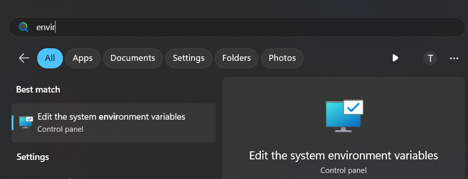
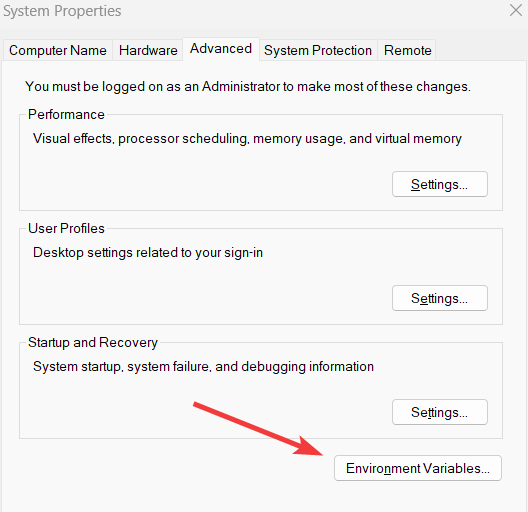
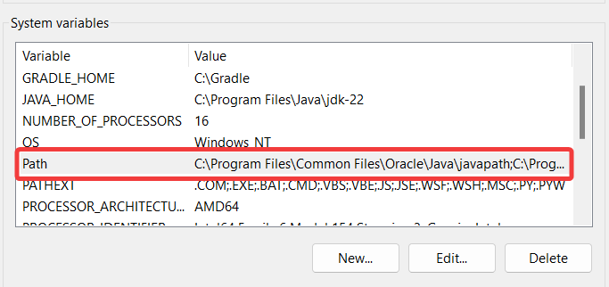

# big-project-group-6

Dự án lớn về Quản lý Sách với Java OOP

- bgsix: Là tên nhóm: Big Group Six (nhóm 6)

<div align="center">
  <a href="https://github.com/neilfranci/book-management-SJPM">English</a> |
  <span>Vietnamese</span>
</div>
<br/>

## Mục Lục

### 1. Yêu cầu cài đặt trước cho Windows

1. [Cài đặt Postgresql](#1-cài-đặt-postgresql-download)
2. [Thêm chương trình cần thiết vào đường dẫn](#2-thêm-chương-trình-cần-thiết-vào-đường-dẫn)
3. [Tạo cơ sở dữ liệu](#3-tạo-cơ-sở-dữ-liệu)
4. [Nhập cơ sở dữ liệu](#4-nhập-cơ-sở-dữ-liệu)
5. [Cài đặt Maven](#1-cài-đặt-maven)
6. [Cài đặt GraalVM native-image](#2-cài-đặt-graalvm) (Thay thế Java SDK)
7. [Cài đặt các yêu cầu cho GraalVM native-image (Production)](#3-cài-đặt-các-yêu-cầu-cho-graalvm-native-image-để-xây-dựng-bản-production)

### 2. Setup Dự án

1. [Clone dự án](#1-clone-dự-án)
2. [Mở dự án trong IDE yêu thích của bạn](#2-mở-dự-án-trong-ide-yêu-thích-của-bạn)

### 3. [Chạy Client](#3-chạy-client)

1. [Chạy client (Development)](#31-chạy-client-development)
2. [Chạy client (Production)](#32-chạy-client-production)

### 4. [Chạy Server](#4-chạy-server)

1. [Chỉnh sửa tệp `.env` (server)](#41-chỉnh-sửa-tệp-env-server)
2. [Chạy server (Development)](#42-chạy-server-development)
3. [Xây dựng native image (Production)](#43-xây-dựng-native-image-production)

---

## Cài đặt Postgresql cho Windows

### 1. [Cài đặt Postgresql (download)](https://www.enterprisedb.com/downloads/postgres-postgresql-downloads)

1.1 Nhấn vào Setup, sau đó nhấn "Next".

1.2 Bạn đang ở phần "Select Components".

1.3 Bỏ chọn "Stack Builder".


1.4 Nhấn "Next" cho đến khi gặp phần nhập mật khẩu cho superuser. Nhập mật khẩu của bạn.

`Cổng mặc định là 5432`

1.5 Tiếp tục nhấn "Next" cho đến khi gặp phần "Installing".

1.6 Đợi cho đến khi hoàn tất và nhấn "Finish". XONG!

### 2. Thêm chương trình cần thiết vào đường dẫn

Đường dẫn cài đặt mặc định là:

```pwsh
C:\Program Files\PostgreSQL\16\bin
```

Mở biến môi trường hệ thống trên Windows.





- Nhấp đúp vào "Path" trong phần hệ thống.



- Nhấn "New"
- Dán đường dẫn vào
- Nhấn "OK"


### 3. Tạo cơ sở dữ liệu

#### 3.1. Xác minh đường dẫn đã được thêm vào môi trường

- Mở Command Prompt hoặc PowerShell

```pwsh
psql -V

# Kết quả : psql (PostgreSQL) 16.4
```

#### 3.2. Nếu lệnh trên trả về như trên thì tiếp tục phần tiếp theo

- Tạo cơ sở dữ liệu

```pwsh
createdb -U postgres book-management
```

- Nhập mật khẩu của bạn từ [Cài đặt postgresql](#1-cài-đặt-postgresql-download).

> Ở đây chúng ta sử dụng superuser mặc định "postgres".

#### 3.3 Xác minh cơ sở dữ liệu đã được tạo

```pwsh
psql -U postgres

# Sau đó trong console
postgres=#

# Nhập: \l (không phải số 1)

postgres=# \l

```

> Nhập \q để thoát khỏi console hoặc Ctrl + C

- Kết quả ví dụ:


### 4. Nhập cơ sở dữ liệu

- Mở Terminal trong thư mục dự án (root)
- Tệp book-management.sql nằm ở thư mục gốc của dự án (sử dụng đường dẫn tương đối để nhập cơ sở dữ liệu).

- Nếu có file `book-management.sql` ở root thì chạy lệnh sau:

```pwsh
psql -U postgres -f .\book-management.sql book-management
```

`---------^username----^file path----------- ^database name`

- Xác minh cơ sở dữ liệu đã được nhập

```pwsh
psql -U postgres -d book-management

# Sau đó trong console

SELECT author FROM book LIMIT 5;       # để xem dữ liệu
```

### 1. Cài đặt Maven

- Tải Maven từ <https://maven.apache.org/download.cgi>
  - Tệp zip binary `apache-maven-3.9.9-bin.zip`
- Giải nén tệp zip đến vị trí mong muốn
  - Ví dụ: `C:\apache-maven-3.9.9` (đảm bảo có thư mục `bin` trong thư mục `apache-maven-3.9.9`)
- Thêm đường dẫn Maven vào biến môi trường hệ thống
  - Mở biến môi trường
  - Nhấp đúp vào `Path` trong phần người dùng
  - Nhấn "New"
  - Dán đường dẫn `C:\apache-maven-3.9.9\bin`
  - Nhấn "OK"

- Xác minh cài đặt Maven

```pwsh
mvn -v
# Kết quả: Apache Maven 3.9.9
```

### 2. Cài đặt GraalVM

- Tải GraalVM từ <https://www.graalvm.org/downloads/>
  - Đảm bảo chọn phiên bản Java 22 và Windows 64 bit
- Giải nén tệp zip đến vị trí mong muốn
  - Ví dụ: `C:\Program Files\Java\graalvm-jdk-22.0.2+9.1\bin` (đảm bảo có thư mục `bin` trong thư mục `graalvm-jdk-22.0.2+9.1`)
- Thêm đường dẫn GraalVM vào biến môi trường hệ thống
  - Mở biến môi trường
  - Nhấp đúp vào `Path` trong phần người dùng
  - Nhấn "New"
  - Dán đường dẫn `C:\Program Files\Java\graalvm-jdk-22.0.2+9.1\bin`
  - Nhấn "OK"

- Xác minh cài đặt GraalVM

```pwsh
java -version
# Kết quả: 
# java version "22.0.2" 2024-07-16
# Java(TM) SE Runtime Environment Oracle GraalVM 22.0.2+9.1 (build 22.0.2+9-jvmci-b01)
# Java HotSpot(TM) 64-Bit Server VM Oracle GraalVM 22.0.2+9.1 (build 22.0.2+9-jvmci-b01, mixed mode, sharing)
```

### 3. Cài đặt các yêu cầu cho GraalVM native-image để xây dựng bản Production

- Thực hiện theo hướng dẫn từ <https://www.graalvm.org/latest/docs/getting-started/windows/#prerequisites-for-native-image-on-windows>

## Thiết lập Dự án

### 1. Clone dự án

```bash
git clone https://github.com/neilfranci/book-management-SJPM.git
```

### 2. Mở dự án trong IDE yêu thích của bạn

2.1 VSCode

cd đến thư mục dự án

```bash
code .
```

Cài đặt extension VS Code cho Java từ <https://marketplace.visualstudio.com/items?itemName=vscjava.vscode-java-pack>

Sau đó đợi extension cài đặt xong

```bash
mvn clean install
```

### 3. Chạy Client

#### 3.1 Chạy client (Development)

```bash
mvn -pl client javafx:run
```

#### 3.2 Chạy client (Production)

```bash
mvn -pl client javafx:jlink
```

Sau đó chạy tệp thực thi trong thư mục target
`.\client\target\client\bin\Client`

Bản build production nằm trong thư mục `.\client\target\client`
và cũng có tệp zip trong thư mục `.\client\target`.

### 4. Chạy Server

#### 4.1 Chỉnh sửa tệp `.env` (server)

```bash
server\.env.template
```

- Tạo một tệp mới `.env` ở cùng đường dẫn và sao chép nội dung từ `.env.template` sang `.env`.

- Thay thế giá trị bằng giá trị của bạn.

#### 4.2 Chạy server (Development)

```bash
mvn -pl server spring-boot:run
```

#### 4.3 Xây dựng native image (Production)

```bash
mvn -pl server -Pnative native:compile -DskipTests
```

- Sau đó

 chạy tệp thực thi trong thư mục target
`.\server\target\server` (native image là một tệp duy nhất), trong trường hợp này, tệp là `server.exe`.
